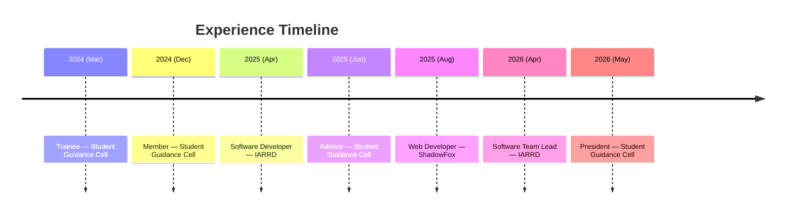

<div align="center">


<br/>


<br/>

[](https://www.linkedin.com/in/mohammedayaz-profile)
[](mailto:mohammedayaz2411@gmail.com)
[](https://www.instagram.com/__md.ayaz__)


</div>


## 🧬 About Me


```yaml
name: Mohammed Ayaz
role: Final-Year Computer Science Engineering Student
location: Ambur, Tamil Nadu, India
institution: C. Abdul Hakeem College of Engineering & Technology
focus:
  - Full-Stack Web Development
  - Backend Engineering & System Design
  - Data Structures & Algorithms (Java)
  - AI-Assisted Application Development
currently:
  - Preparing for SDE roles across India
  - Leading Student Guidance Cell as President
status: Open to Internships, SDE Roles & Collaborations
```

I'm a final-year CSE student who prioritizes **execution over theory** — building production-grade applications shaped by real-world constraints like scale, time, and maintainability. My work spans **Python/FastAPI backends**, **MERN & full-stack builds**, and **AI-driven features**, forged through internships, hackathons, and live event deployments handling real registration workflows and payment integrations.

<br clear="right"/>


## 🕰️ Developer Journey

<div align="center">



</div>

<table align="center">
<tr>
<td width="50%" valign="top">

### 🏛️ Student Guidance Cell
**2 years 5 months** · Trainee → Member → Advisor → **President**

A student-led, inter-department organization driving student development through national-level symposiums, workshops, and tech events. Progressed through every tier of leadership before being elected President in May 2026.

</td>
<td width="50%" valign="top">

### 🚀 IARRD
**Indian Astronomy Rocket & Research Development**
Software Developer → **Software Team Lead**

Built and led development of workshop registration platforms for live astronomy events, evolving from individual contributor to team leadership.

</td>
</tr>
</table>


## 🏆 Achievements & Certifications

<div align="center">


</div>


## 🛠️ Tech Stack

<div align="center">

**Languages**
<br/>


**Frontend**
<br/>


**Backend & Databases**
<br/>


**Data & Libraries**
<br/>


**Tools & Platforms**
<br/>


**Core CS**
<br/>


</div>


## 🚀 Selected Projects

<table align="center" width="100%">
<tr>
<td width="50%" valign="top">

### 🛡️ AvengerCore
**AI-Assisted Fraud Detection**

`React Native` `FastAPI` `Transformers`

- Scam detection engine for messages and apps.
- Risk scoring with explainable, human-readable alerts.
- Modular, extensible backend architecture.

</td>
<td width="50%" valign="top">

### 🖨️ PrintMate
**Smart Printing Platform**

`React` `Firebase`

- Online print order management system
- Document upload, print configuration & tracking
- Built for campus and small-business use cases

</td>
</tr>
</table>

<div align="center">
<sub>More production-grade builds are in active development — check pinned repositories for the latest.</sub>
</div>


### 🐍 Contribution Snake


</div>


## 🧠 Engineering Principle

<div align="center">

> *Simple code scales.*
> *Clear thinking compounds.*
> *Execution wins.*

</div>


## 📫 Let's Connect

<div align="center">

[](mailto:mohammedayaz2411@gmail.com)
[](https://www.linkedin.com/in/mohammedayaz-profile)
[](https://www.instagram.com/__md.ayaz__)

</div>


<div align="center">
<sub>From <a href="https://github.com/mohammedayaz24"><b>Mohammed Ayaz</b></a> — built with intent.</sub>
</div>
